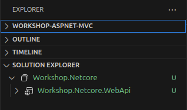

# Capítulo 1 - Criação de um projeto de WebApi

## Criação de um novo projeto utilizando o template `webapi`
O comando `dotnet new` é utilizado para criar novos projetos. É possível consultar a lista de templates disponíveis através do comando `dotnet new --list`.

Nós criaremos um projeto do tipo `webapi`. Por padrão esse template cria um projeto utilizando **minimal api** mas utilizaremos o padrão **mvc** ao incluir o parâmetro `--use-controllers`.

```console
$ dotnet new webapi --use-controllers \
                     -n Workshop.Netcore.WebApi \
                     -o src/Workshop.Netcore.WebApi
The template "ASP.NET Core Web API" was created successfully.

Processing post-creation actions...
Restoring src/Workshop.Netcore.WebApi/Workshop.Netcore.WebApi.csproj:
  Determining projects to restore...
  Restored src/Workshop.Netcore.WebApi/Workshop.Netcore.WebApi.csproj (in 330 ms).
Restore succeeded.
```

Isso vai criar a seguinte estrutura de pastas (o arquivo de extensão `.csproj` é o arquivo de projeto):

```
...
src
└── Workshop.Netcore.WebApi
    ├── appsettings.Development.json
    ├── appsettings.json
    ├── Controllers
    │   └── WeatherForecastController.cs
    ├── obj
    │   └── ...
    ├── Program.cs
    ├── Properties
    │   └── launchSettings.json
    ├── WeatherForecast.cs
    ├── Workshop.Netcore.WebApi.csproj
    └── Workshop.Netcore.WebApi.http
```

Agora precisamos criar um arquivo de solution com a extensão `.sln`. O `dotnet new` possui um template para isso também:

```console
$ dotnet new sln -o src/ -n Workshop.Netcore
The template "Solution File" was created successfully.
```

E por último, precisamos incluir o arquivo de projeto na solução:

```console
$ dotnet sln src/Workshop.Netcore.sln add src/Workshop.Netcore.WebApi
Project `Workshop.Netcore.WebApi/Workshop.Netcore.WebApi.csproj` added to the solution.
```

As extensões do VSCode instaladas anteriormente já identificam automaticamente arquivos de sln na pasta e uma nova seção chamada `Solution Explorer` fica disponível no explorer:



Vamos iniciar a API clicando com o botão direito no projeto e clicando em `Debug -> Start new Instance`. Uma aba no navegador com o `swagger` irá abrir automaticamente.