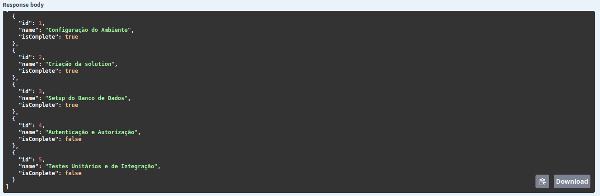

# Capítulo 2 - `TodoController`
Vamos criar uma controller com operações CRUD para uma lista de *todos*. 

Ao final deste capítulo os seguintes endpoints estarão implementados:

|               Endpoint         |        Descrição          | Request body |     Response body    |
|:-------------------------------|:--------------------------|:-------------|:---------------------|
| `GET /api/todoitems`           | Get all to-do items       | None         | Array of to-do items |
| `GET /api/todoitems/{id}`      | Get an item by ID         | None         | To-do item           |
| `POST /api/todoitems`          | Add a new item            | To-do item   | To-do item           |
| `PUT /api/todoitems/{id}`      | Update an existing item   | To-do item   | None                 |
| `DELETE /api/todoitems/{id}`   | Delete an item            | None         | None                 |
---

## Definição da Model
Crie uma pasta chamada `Models` na raíz do projeto e dentro dela crie um arquivo `TodoItem.cs`:

```c#
namespace Workshop.Netcore.WebApi.Models;

public class TodoItem
{
    public long Id { get; set; }
    public string? Name { get; set; }
    public bool IsComplete { get; set; }
}
```

## Conexão com o Banco de Dados
### 1. Instalação do EntityFrameWorkCore no projeto

Utilizaremos o sqlite para este projeto. Instale o NuGet
`Microsoft.EntityFrameworkCore.Sqlite` através do cli:

```
$ dotnet add src/Workshop.Netcore.WebApi package Microsoft.EntityFrameworkCore.Sqlite
```

Também é possível instalar clicando com o botão direito no projeto
dentro da solution explorer e em seguida em `Add Nuget Package`.

### 2. Definindo um DbContext
A classe `DbContext` é a responsável por fazer a interface com o banco de dados.
O próprio `DbContext` é um UnitOfWork e precisamos implementar nossa própria classe 
de context herdando a `DbContext`. Aqui fazemos as configurações de mapeamento,
de acesso ao banco de dados e também declaramos os `DbSet`, que são as coleções das
nossas entidades.

Crie uma pasta chamada `Database`e dentro dela o arquivo `WebApiDbContext.cs`:

```c#
using Microsoft.EntityFrameworkCore;
using Workshop.Netcore.WebApi.Models;

namespace Workshop.Netcore.WebApi.Database;

public class WebApiDbContext : DbContext
{
    public WebApiDbContext(DbContextOptions<WebApiDbContext> options) : base(options)
    {
    }

    public DbSet<TodoItem> TodoItems { get; set; } = null!;
}

```
### 3. Registrando nosso DbContext no container de injeção de dependencias

Existem diversas maneiras de passar uma configuração para nosso `DbContext`.
Neste exemplo iremos utilizar o objeto de configuração disponível no momento da injeção.

Antes disso, vamos incluir no arquivo `apsettings.json` a nossa *ConnectionString* do sqlite:

```json
{
  "ConnectionStrings": {
    "WebApiLocalDatabase": "Data Source=app.db"
  },
  "Logging": {
    "LogLevel": {
      "Default": "Information",
      "Microsoft.AspNetCore": "Warning"
    }
  },
  "AllowedHosts": "*"
}
```

No topo do arquivo `Program.cs` inclua o `using Microsoft.Extensions.Configuration` para termos
acesso ao método de extensão `GetConnectionString`.

```c#
builder.Services.AddDbContext<WebApiDbContext>(opt => 
    opt.UseSqlite(builder.Configuration.GetConnectionString("WebApiLocalDatabase")));
```

> **_NOTA:_** É possível ter diferentes configurações baseado no ambiente. Por exemplo, quando 
a aplicação rodar localmente é possível usar o `UseSqlite` e em outro ambiente (uma variável
de ambiente pode ser utilizada para verificar o ambiente) o `UseSqlServer` (disponível no Nuget
`Microsoft.EntityFrameworkCore.SqlServer`) pode ser utilizado.

### 4. Criação da controller

Utilizaremos o comando `dotnet aspnet-codegenerator` para gerar uma Controller
contendo o CRUD. O comando recebe o nome da nossa Model e do nosso DbContext como
parâmetro. É necessário instalar alguns pacotes Nuget e algumas ferramentas do donet
cli:

```console
src/Workshop.Netcore.Webpi$ dotnet add package Microsoft.VisualStudio.Web.CodeGeneration.Design
src/Workshop.Netcore.Webpi$ dotnet add package Microsoft.EntityFrameworkCore.Design
src/Workshop.Netcore.Webpi$ dotnet add package Microsoft.EntityFrameworkCore.Tools
src/Workshop.Netcore.Webpi$ dotnet tool uninstall -g dotnet-aspnet-codegenerator
src/Workshop.Netcore.Webpi$ dotnet tool install -g dotnet-aspnet-codegenerator
src/Workshop.Netcore.Webpi$ dotnet tool update -g dotnet-aspnet-codegenerator

src/Workshop.Netcore.Webpi$ dotnet aspnet-codegenerator controller -name TodoItemsController -async -api -m TodoItem -dc WebApiDbContext -outDir Controllers -dbProvider sqlite
```
Após isso, a pasta `src/Workshop.Netcore.WebApi/Controllers/` irá conter o arquivo `TodoItemsController.cs`.

### 5. Migrations

A aplicação ja está preparada para conectar com o banco de dados, falta apenas aplicar as migrações
para criarmoas as tabelas necessárias. Para isso são necessário dois pacotes nuget:
`Microsoft.EntityFrameworkCore.Tools` e `Microsoft.EntityFrameworkCore.Design`.
Ambos foram instalados no passo anterior.

Também é necessário [instalar o cli do dotnet ef](https://learn.microsoft.com/en-us/ef/core/cli/dotnet):

```
$ dotnet tool install --global dotnet-ef
You can invoke the tool using the following command: dotnet-ef
Tool 'dotnet-ef' (version '8.0.6') was successfully installed.
```

Criamos uma nova migração com o comando `dotnet ef migrations add`:

```
$ dotnet ef migrations add TodoItems
Build started...
Build succeeded.
Done. To undo this action, use 'ef migrations remove'
```

Após a execução do comando é possível notar a criação da pasta `Migrations`:

```
── Migrations
│   ├── 20240615182058_TodoItems.cs
│   ├── 20240615182058_TodoItems.Designer.cs
│   └── WebApiDbContextModelSnapshot.cs
```

Existem algumas maneiras diferentes de se aplicar as migrações geradas.
Todas as maneiras possíveis podem ser encontradas nesta documentação:
https://learn.microsoft.com/en-us/ef/core/managing-schemas/migrations/applying?tabs=dotnet-core-cli.

Podemos espiar o SQL gerado pela migração através do comando:

```
src/Workshop.Netcore.WebApi$ dotnet ef migrations script
Build started...
Build succeeded.
CREATE TABLE IF NOT EXISTS "__EFMigrationsHistory" (
    "MigrationId" TEXT NOT NULL CONSTRAINT "PK___EFMigrationsHistory" PRIMARY KEY,
    "ProductVersion" TEXT NOT NULL
);

BEGIN TRANSACTION;

CREATE TABLE "TodoItems" (
    "Id" INTEGER NOT NULL CONSTRAINT "PK_TodoItems" PRIMARY KEY AUTOINCREMENT,
    "Name" TEXT NULL,
    "IsComplete" INTEGER NOT NULL
);

INSERT INTO "__EFMigrationsHistory" ("MigrationId", "ProductVersion")
VALUES ('20240615182058_TodoItems', '8.0.6');

COMMIT;
```

Nós iremos utilizar o bundle que gera um arquivo executável que aplica as 
migrações. Primeiro vamos criar um arquivo sqlite vazio:

```
src/Workshop.Netcore.WebApi$ sqlite3 app.db ''
```

Em seguida vamos criar o bundle. O parâmetro `--self-contained` permite que o executável
não dependa da existência do .NET runtime instalado no ambiente em que for executado.

```
src/Workshop.Netcore.WebApi$ dotnet ef migrations bundle --self-contained -r linux-x64
Build started...
Build succeeded.
Building bundle...
Done. Migrations Bundle: /home/bruno/dev/workshop-aspnet-mvc/src/Workshop.Netcore.WebApi/efbundle
Don't forget to copy appsettings.json alongside your bundle if you need it to apply migrations.
```

E em seguida, vamos executar o arquivo `efbundle` gerado:

```
src/Workshop.Netcore.WebApi$ ./efbundle
info: Microsoft.EntityFrameworkCore.Database.Command[20101]
      Executed DbCommand (8ms) [Parameters=[], CommandType='Text', CommandTimeout='30']
      SELECT COUNT(*) FROM "sqlite_master" WHERE "name" = '__EFMigrationsHistory' AND "type" = 'table';
info: Microsoft.EntityFrameworkCore.Database.Command[20101]
      Executed DbCommand (12ms) [Parameters=[], CommandType='Text', CommandTimeout='30']
      CREATE TABLE "__EFMigrationsHistory" (
          "MigrationId" TEXT NOT NULL CONSTRAINT "PK___EFMigrationsHistory" PRIMARY KEY,
          "ProductVersion" TEXT NOT NULL
      );
info: Microsoft.EntityFrameworkCore.Database.Command[20101]
      Executed DbCommand (0ms) [Parameters=[], CommandType='Text', CommandTimeout='30']
      SELECT COUNT(*) FROM "sqlite_master" WHERE "name" = '__EFMigrationsHistory' AND "type" = 'table';
info: Microsoft.EntityFrameworkCore.Database.Command[20101]
      Executed DbCommand (0ms) [Parameters=[], CommandType='Text', CommandTimeout='30']
      SELECT "MigrationId", "ProductVersion"
      FROM "__EFMigrationsHistory"
      ORDER BY "MigrationId";
info: Microsoft.EntityFrameworkCore.Migrations[20402]
      Applying migration '20240615182058_TodoItems'.
Applying migration '20240615182058_TodoItems'.
info: Microsoft.EntityFrameworkCore.Database.Command[20101]
      Executed DbCommand (0ms) [Parameters=[], CommandType='Text', CommandTimeout='30']
      CREATE TABLE "TodoItems" (
          "Id" INTEGER NOT NULL CONSTRAINT "PK_TodoItems" PRIMARY KEY AUTOINCREMENT,
          "Name" TEXT NULL,
          "IsComplete" INTEGER NOT NULL
      );
info: Microsoft.EntityFrameworkCore.Database.Command[20101]
      Executed DbCommand (0ms) [Parameters=[], CommandType='Text', CommandTimeout='30']
      INSERT INTO "__EFMigrationsHistory" ("MigrationId", "ProductVersion")
      VALUES ('20240615182058_TodoItems', '8.0.6');
Done.
```

Neste momento temos uma aplicação completa. Ao executar a api novamente, todos os
endpoints da controller de *todo* estarão funcionando:



---
Este tutorial foi baseado no seguinte tutorial: https://learn.microsoft.com/en-us/aspnet/core/tutorials/first-web-api?view=aspnetcore-8.0